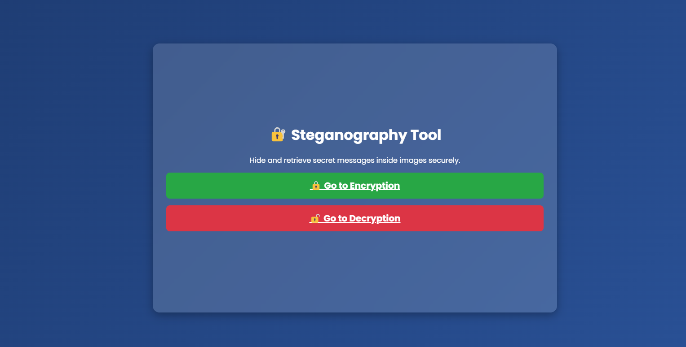
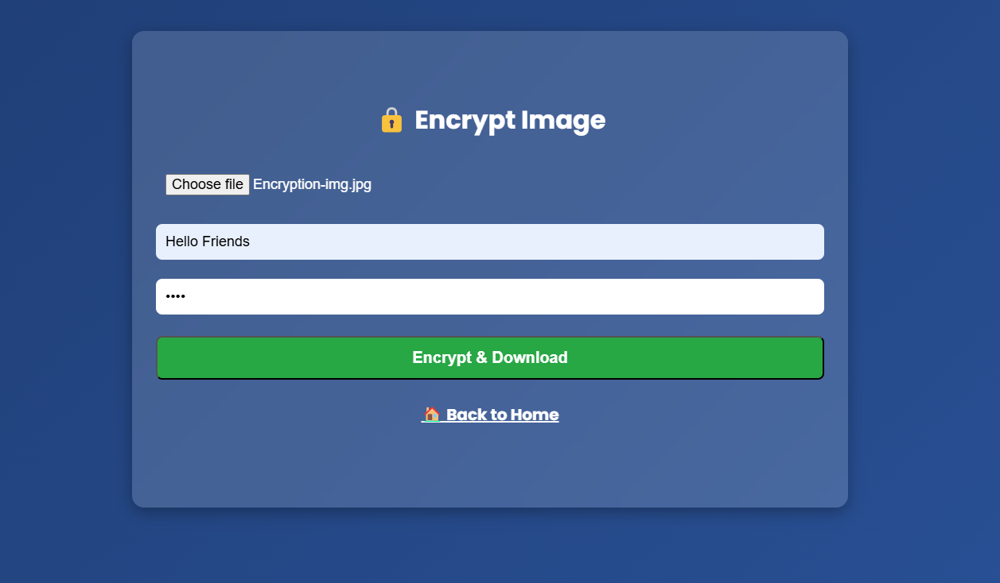
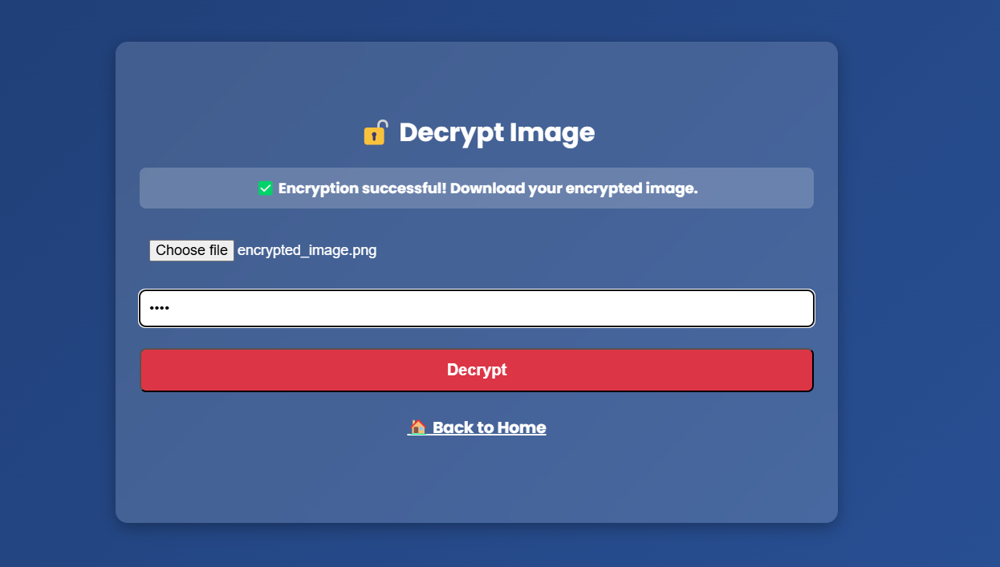
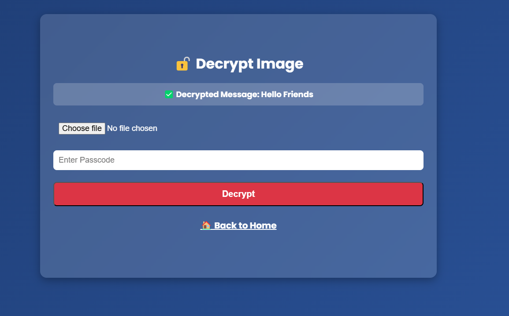

# 🔐 Steganography Tool - Encrypt & Decrypt Messages in Images

This project is a **web-based steganography tool** that allows users to **hide messages** inside images and **retrieve them** using a secret passcode. 

🚀 **Features:**
- Upload an image to hide a **secret message**.
- Encrypt the image with a **passcode**.
- Decrypt the image to **retrieve the hidden message**.
- **Beautiful UI** with animations.
- **Fully responsive** for desktop users.

---

## 🖼️ Screenshots

### **Home Page**


### **Encryption Page**


### **Decryption Page**


### **Final Output**


---

## 🛠️ Installation & Setup

### **1️⃣ Clone the Repository**
```bash
git clone https://github.com/Sairam-Panuku/Steganography_Project.git
cd Steganography_Project
```

### **2️⃣ Install Dependencies**
```bash
pip install -r requirements.txt
```

### **3️⃣ Run the Application**
```bash
python app.py
```
> **Open in Browser:** `http://127.0.0.1:5000/`

---

## 📂 Project Structure
```
Steganography_Project/
│── static/               # CSS & JavaScript
│── templates/            # HTML Files
│── uploads/              # Encrypted Images
│── app.py                # Main Flask Application
│── encrypt.py            # Encryption Logic
│── decrypt.py            # Decryption Logic
│── README.md             # Project Documentation
│── requirements.txt      # Dependencies
│── screenshots/          # Folder for Screenshots
│   ├── Home.png
│   ├── Encrypt.png
│   ├── Decrypt.png
│   ├── Final-Output.png
```

---

## 🤝 Contributing
Feel free to contribute to this project by **forking** the repository and submitting a **pull request**.

---

## 📜 License
This project is **open-source** and free to use under the **MIT License**.

---

### **👨‍💻 Developed by [Sairam Panuku](https://github.com/Sairam-Panuku)**
```
